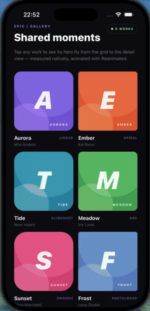
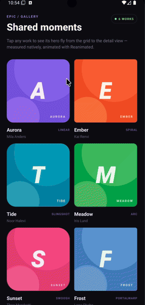

# React Native Epic Shared Element

A **native**, **lightweight**, and **customizable** shared-element transition
library for React Native.
It measures views on iOS and Android, then animates their geometry with
`react-native-reanimated`.

---

## ✨ Features

- 🎯 Native frame measurement on iOS and Android
- 🎯 Smooth size and position interpolation between two elements
- 🎯 `resize` and `zoom` transition modes
- 🎯 Built-in presets: `linear`, `spiral`, `slingshot`, `arc`, `swoosh`, and `portalWarp`
- 🎯 Custom transition presets with worklet support
- 🎯 Optional border-radius interpolation
- 🎯 Custom transition elements
- 🎯 Configurable clipping and frame tracking
- 🎯 TypeScript support out of the box
- 🎯 Compatible with React Native New Architecture

---

## 🎥 Demo

The repository includes a complete example gallery in [`example/src/App.tsx`](example/src/App.tsx).
It demonstrates multiple transition presets, native measurements, custom radii,
and transitions between different element sizes.

<p align="center">
  
  
</p>

To run the example:

```bash
yarn install
yarn example ios
```

or

```bash
yarn example android
```

---

## 📦 Installation

```bash
npm install react-native-epic-shared-element react-native-reanimated react-native-worklets
```

or

```bash
yarn add react-native-epic-shared-element react-native-reanimated react-native-worklets
```

> **Note:**
> Make sure `react-native-reanimated` and `react-native-worklets` are configured
> according to their installation guides.

---

## 🚀 Basic Usage

```tsx
import { useCallback } from 'react';
import { Button, Image } from 'react-native';
import {
  SharedElement,
  SharedElementHost,
  SharedElementPresets,
  SharedElementProvider,
  SharedElementTransition,
} from 'react-native-epic-shared-element';
import { useSharedValue, withTiming } from 'react-native-reanimated';

const artwork = require('./artwork.png');

export function Screen() {
  const progress = useSharedValue(0);

  const open = useCallback(() => {
    progress.value = withTiming(1, { duration: 620 });
  }, [progress]);

  return (
    <SharedElementProvider>
      <SharedElementHost style={{ flex: 1 }}>
        <Button title="Open artwork" onPress={open} />

        <SharedElement id="artwork-small" borderRadius={24}>
          <Image source={artwork} style={{ width: 120, height: 120 }} />
        </SharedElement>

        <SharedElementTransition
          startId="artwork-small"
          endId="artwork-large"
          progress={progress}
          mode="resize"
          transition={SharedElementPresets.linear}
        />

        <SharedElement id="artwork-large" borderRadius={8}>
          <Image source={artwork} style={{ width: 320, height: 420 }} />
        </SharedElement>
      </SharedElementHost>
    </SharedElementProvider>
  );
}
```

`progress` is a Reanimated `SharedValue<number>` in the range `0..1`.
The `SharedElementHost` defines the coordinate space used by native
measurements.

Every `SharedElement` must be inside a `SharedElementHost`. Native measurements
are layout coordinates relative to that host: ancestor translations/scales used
for presentation are excluded, while scroll offsets inside the host are included.
The host is kept in the native view hierarchy on both Fabric and Paper. Until its
native ref is ready, no measurement is emitted; there is no fallback to window
coordinates. Render the transition overlay at the host's origin. If elements use
different hosts, their origins and coordinate units must be aligned by the caller.

`onFrameChange` reports only delivered geometry changes. Its event contains the
previous and current rect plus `framesDiff`, the number of sampled native display
frames since the previous delivered change. `onFrameSettled` fires once per native
view, when its initial rect remains unchanged for two consecutive display frames.
By default, measurement continues after the initial settle so scrolling and other
ancestor layout changes keep the rect current. Set `trackFrame={false}` to stop
continuous measurement; it resumes for one sample after a later element layout.

`useSharedElementRegistry().waitForStableRects(ids, callback)` remains available
to coordinate the initial settle of several elements. It returns a cancellation
function and does not drive animations or navigation.

### Text content

Mark text explicitly so a stretched layout box is not mistaken for glyph width:

```tsx
<SharedElement id="title-small" contentType="text">
  <Text style={{ fontSize: 26 }}>Orbit</Text>
</SharedElement>
```

The transition inherits `contentType="text"` from either endpoint; it can also be
set directly on `SharedElementTransition`. Text keeps its source layout and uses
one uniform scale based on the measured height ratio, in both `zoom` and `resize`
modes. This avoids squeezed/widened letters when the endpoint containers have
different aspect ratios. It does not interpolate font families, weights, or line
breaks; use matching text/layout when a seamless handoff is needed. The default
`contentType="view"` retains the existing view/image sizing behavior.

---

## 🎨 Transition Presets

Built-in presets are available from `SharedElementPresets`:

```tsx
<SharedElementTransition
  startId="artwork-small"
  endId="artwork-large"
  progress={progress}
  mode="resize"
  transition={SharedElementPresets.spiral}
/>
```

Available presets:

| Preset       | Description                                     |
| :----------- | :---------------------------------------------- |
| `linear`     | Direct interpolation from source to destination |
| `spiral`     | Curved movement with rotation                   |
| `slingshot`  | Accelerated movement with an overshooting arc   |
| `arc`        | Arc movement with subtle scale and rotation     |
| `swoosh`     | Bézier swoosh path                              |
| `portalWarp` | Bézier path with scale and opacity distortion   |

### Custom preset

Custom presets are worklet callbacks. The transition controls the element size;
your preset can customize position, transforms, and opacity:

```tsx
const customPreset = ({ progress: t, start, end }) => {
  'worklet';

  return {
    left: start.x + (end.x - start.x) * t,
    top: start.y + (end.y - start.y) * t - Math.sin(t * Math.PI) * 24,
    transform: [{ rotate: `${t * Math.PI}rad` }],
  };
};

<SharedElementTransition
  startId="artwork-small"
  endId="artwork-large"
  progress={progress}
  mode="resize"
  transition={customPreset}
/>;
```

---

## ⚙️ API

### `SharedElement`

| Prop           | Type      | Default | Description                                          |
| :------------- | :-------- | :------ | :--------------------------------------------------- |
| `id`           | `string`  | —       | Unique identifier used by the transition             |
| `borderRadius` | `number`  | —       | Native border radius, interpolated during transition |
| `trackFrame`   | `boolean` | `true`  | Continuously measure a moving element                |
| `throttle`     | `number`  | `16`    | Frame measurement interval in milliseconds           |

### `SharedElementTransition`

| Prop         | Type                            | Default  | Description                                         |
| :----------- | :------------------------------ | :------- | :-------------------------------------------------- |
| `startId`    | `string`                        | —        | Source shared-element ID                            |
| `endId`      | `string`                        | —        | Destination shared-element ID                       |
| `progress`   | `SharedValue<number>`           | —        | Transition progress from `0` to `1`                 |
| `mode`       | `"resize"` / `"zoom"`           | `"zoom"` | Controls how the element scales between frames      |
| `transition` | `SharedElementTransitionConfig` | `linear` | Position and decoration preset                      |
| `clip`       | `boolean`                       | `true`   | Clips the transition element to its animated bounds |
| `element`    | `ReactElement`                  | —        | Custom element rendered during the transition       |

`resize` interpolates width and height directly from source to destination.
`zoom` keeps the source frame and scales it to match the destination dimensions.

You can also pass the transition element as a child:

```tsx
<SharedElementTransition
  startId="artwork-small"
  endId="artwork-large"
  progress={progress}
  element={<Image source={artwork} />}
/>
```

---

## 🛠 Requirements

- React Native >= 0.71
- `react-native-reanimated` >= 3.16
- `react-native-worklets` >= 0.5
- iOS and Android

---

## 🤝 Contributing

We welcome contributions!
Please read the [Contributing Guide](CONTRIBUTING.md) to learn how to help
improve Epic Shared Element.

---

## 📄 License

MIT License © 2024 [Oleh Mazur](https://github.com/mazurGit)

---

> Built with ❤️ using [create-react-native-library](https://github.com/callstack/react-native-builder-bob)
